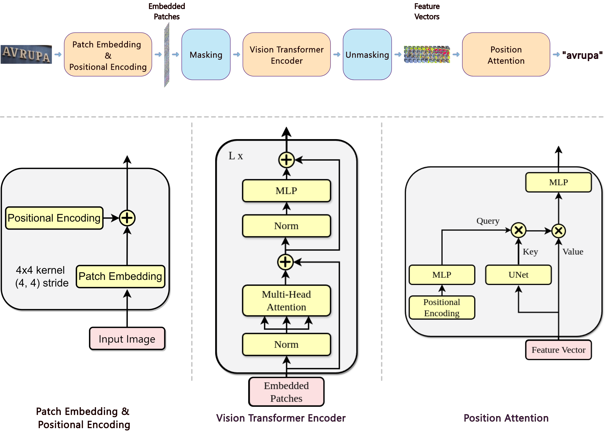

# !Paper! MViT-TR: Masked Vision Transformer for Text Recognition

<font size='3'> <p align="center">
    <a href='https://scholar.google.com/citations?user=sl1KrkYAAAAJ&hl=tr'> Serdar Yıldız* </a> 
</p></font>

<p align="center">
    <a href='https://huggingface.co/spaces/serdaryildiz/MViT-TR'></a> 
</p>
<p align="center">
    <a href='https://www.sciencedirect.com/science/article/pii/S2215098624002672'></a>
    <a href="https://opensource.org/licenses/MIT"></a>
</p>


---

## Overview

MViT-TR (Masked Vision Transformer for Text Recognition) is a novel transformer-based model for Turkish Scene Text Recognition, addressing the unique challenges posed by the Turkish language, including diacritic marks and language-specific characters. MViT-TR achieves high accuracy by leveraging a position attention module alongside transformers, achieving state-of-the-art results on Turkish STR tasks.



*Figure 1: MViT-TR architecture.*

---

## Abstract

In the advancing field of computer vision, scene text recognition (STR) has been progressively gaining prominence. Despite this progress, the lack of a comprehensive study or a suitable dataset for STR, particularly for languages like Turkish, stands out. Existing datasets, regardless of the language, tend to grapple with issues such as limited sample quantity and high noise levels, which considerably restrict the progression and overall efficacy of STR research and applications. Addressing these shortcomings, we introduce the Turkish Scene Text Recognition (TS-TR) dataset, one of the most substantial STR datasets to date, comprising 7288 text instances. In addition, we propose the Synthetic Turkish Scene Text Recognition (STS-TR) dataset, an enormous collection of 12 million samples created using a novel histogram-based method, more efficient than common synthetic data generation methods. Moreover, we present a novel recognition model, the Masked Vision Transformer for Text Recognition (MViT-TR), which achieves a word accuracy of 94.42% on the challenging TS-TR test dataset, underlining its robustness and performance efficacy. We extend our investigation to the influence of synthetic datasets, the utilization of patch masking, and the function of the position attention module on recognition performance. To foster future STR research, we have made all datasets and source codes publicly available.

---

## Datasets

| Dataset | Images | Text Instances | Type | Download Link |
|---------|--------|----------------|------|---------------|
| TS-TR (Real) | 2000 | 7288 | Real-world Turkish Text | [Download](https://www.kaggle.com/datasets/serdaryildiz/turkish-scene-text-recognition-dataset) |
| STS-TR (Synthetic) | - | 12 million | Synthetic Text | [Download](https://www.kaggle.com/datasets/serdaryildiz/synthetic-turkish-scene-text-recognition-dataset) |

The TS-TR dataset is a real-world collection of Turkish text in various urban and natural scenes, while STS-TR provides a synthetic dataset with 12 million samples generated using diverse augmentations.

---

## Installation

To set up MViT-TR for training and evaluation, follow these steps:

1. **Clone the repository:**
   ```bash
   git clone https://github.com/serdaryildiz/MViT-TR.git
   cd MViT-TR

2. **Install required dependencies:**
    ```bash
    pip install -r requirements.txt

3. **Download weights (Optional): ...**

## Training and Evaluation

### Training

1. **Train on STS-TR synthetic data:**
   ```bash
   python train.py --config config/mvt_tr_synthetic.yaml
   ```

2. **Fine-tune on TS-TR real data:**
   ```bash
   python train.py --config config/mvt_tr_real.yaml
   ```

### Evaluation

To evaluate the MViT-TR model:

```bash
python test.py --config <path_to_config> --ckpt <path_to_final_weights>
```

---

## Performance Comparison on Turkish Scene Text Recognition Datasets

| Model    | FPS        | TS-TR Word Acc |
|----------|------------|----------------|
| CRNN     | 801 (±1.3) | 91.49%         |
| ViTSTR   | 696 (±11.6) | 93.51%         |
| ABINet   | 168 (±1.9) | 93.70%         |
| TRBA     | 168 (±1.5) | 94.23%         |
| PARSeq   | 192 (±2.0) | 95.33%     |
| MViT-STR | 353 (±5.9) | 94.42%         |


MViT-TR achieves high recognition accuracy and efficiency on Turkish STR tasks, making it suitable for real-world applications.

---

## Citation

If you find this work useful, please cite our paper:

```bibtex
@article{YILDIZ2024101881,
title = {Turkish scene text recognition: Introducing extensive real and synthetic datasets and a novel recognition model},
journal = {Engineering Science and Technology, an International Journal},
volume = {60},
pages = {101881},
year = {2024},
issn = {2215-0986},
doi = {https://doi.org/10.1016/j.jestch.2024.101881},
url = {https://www.sciencedirect.com/science/article/pii/S2215098624002672},
author = {Serdar Yıldız},
keywords = {Scene text recognition dataset, Synthetic scene text recognition dataset, Patch masking, Position attention, Vision transformers},
}
```

